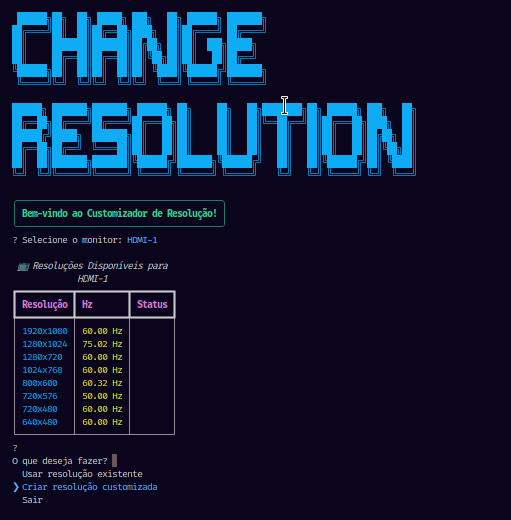

# 🖥️ Change Resolution

<div align="center">

```
 ██████╗██╗  ██╗ █████╗ ███╗   ██╗ ██████╗ ███████╗
██╔════╝██║  ██║██╔══██╗████╗  ██║██╔════╝ ██╔════╝
██║     ███████║███████║██╔██╗ ██║██║  ███╗█████╗  
██║     ██╔══██║██╔══██║██║╚██╗██║██║   ██║██╔══╝  
╚██████╗██║  ██║██║  ██║██║ ╚████║╚██████╔╝███████╗
 ╚═════╝╚═╝  ╚═╝╚═╝  ╚═╝╚═╝  ╚═══╝ ╚═════╝ ╚══════╝
```

**Uma ferramenta interativa e moderna para gerenciar resoluções de tela no Linux**

[](https://www.python.org/downloads/)
[](https://www.linux.org/)

</div>

---

## 📋 Sobre

**Change Resolution** é uma ferramenta de linha de comando intuitiva e elegante que permite gerenciar resoluções de tela em sistemas Linux com interface X11. Com uma interface rica e colorida, você pode facilmente alternar entre resoluções existentes ou criar resoluções customizadas para atender suas necessidades específicas.

### ✨ Características

- 🎯 **Interface Interativa**: Menu intuitivo com navegação por teclado
- 🎨 **Visual Moderno**: Interface colorida usando Rich e ASCII art
- 🖥️ **Multi-Monitor**: Suporte completo para múltiplos monitores
- ⚡ **Resoluções Customizadas**: Crie resoluções personalizadas em qualquer taxa de atualização
- 📊 **Visualização Clara**: Tabelas organizadas mostrando todas as resoluções disponíveis
- 🔄 **Aplicação Instantânea**: Mudanças aplicadas em tempo real

---

## 🚀 Instalação

### Pré-requisitos

- Sistema Linux com X11
- Python 3.8 ou superior
- `xrandr` instalado (geralmente já vem pré-instalado)

### Usando Poetry (Recomendado)

```bash
# Clone o repositório
git clone https://github.com/seu-usuario/change-resolution.git
cd change-resolution

# Instale as dependências com Poetry
poetry install

# Execute o programa
poetry run python main.py
```

### Usando pip

```bash
# Clone o repositório
git clone https://github.com/seu-usuario/change-resolution.git
cd change-resolution

# Instale as dependências
pip install inquirerpy rich

# Execute o programa
python main.py
```

### Usando uv (Alternativa Rápida)

```bash
# Clone o repositório
git clone https://github.com/seu-usuario/change-resolution.git
cd change-resolution

# Instale com uv
uv pip install inquirerpy rich

# Execute o programa
python main.py
```

---

## 📦 Dependências

Este projeto utiliza as seguintes bibliotecas Python:

| Biblioteca | Versão | Descrição |
|------------|--------|-----------|
| **inquirerpy** | ^0.3.4 | Interface interativa de linha de comando |
| **rich** | ^13.7.0 | Formatação e estilização de texto no terminal |

### Arquivo `pyproject.toml`

```toml
[tool.poetry]
name = "change-resolution"
version = "1.0.0"
description = "Ferramenta interativa para gerenciar resoluções de tela no Linux"
authors = ["Seu Nome <seu.email@exemplo.com>"]
readme = "README.md"
license = "MIT"

[tool.poetry.dependencies]
python = "^3.8"
inquirerpy = "^0.3.4"
rich = "^13.7.0"

[tool.poetry.group.dev.dependencies]
pytest = "^7.4.0"

[build-system]
requires = ["poetry-core"]
build-backend = "poetry.core.masonry.api"
```

---

## 🎮 Como Usar

### 1. Iniciando o Programa

```bash
python main.py
```

### 2. Menu Principal

Ao iniciar, você verá:
- Lista de monitores detectados
- Tabela com todas as resoluções disponíveis
- Menu com opções interativas

### 3. Opções Disponíveis

#### 📺 Usar Resolução Existente
- Selecione uma das resoluções já disponíveis no seu monitor
- A mudança é aplicada instantaneamente

#### 🎨 Criar Resolução Customizada
- Digite a largura desejada (ex: 1920)
- Digite a altura desejada (ex: 1080)
- Digite a taxa de atualização em Hz (ex: 144)
- O programa irá:
  1. Gerar o modeline apropriado usando `cvt`
  2. Criar o novo modo de vídeo
  3. Vincular o modo ao seu monitor
  4. Aplicar a resolução automaticamente

---

## 📸 Screenshots

<div align="center">
  
  <p><em>Preview do Projeto</em></p>
</div>

---

## 🛠️ Estrutura do Projeto

```
change-resolution/
├── Change-Resolution.py              # Arquivo principal
├── README.md            # Este arquivo
├── pyproject.toml       # Gerenciamento de dependências (Poetry)
└── .gitignore          # Arquivos ignorados pelo Git
```

---

## 🤝 Contribuindo

Contribuições são bem-vindas! Sinta-se à vontade para:

1. Fazer fork do projeto
2. Criar uma branch para sua feature (`git checkout -b feature/MinhaFeature`)
3. Commit suas mudanças (`git commit -m 'Adiciona nova feature'`)
4. Push para a branch (`git push origin feature/MinhaFeature`)
5. Abrir um Pull Request

---

## 📝 Notas Importantes

⚠️ **Atenção**: As resoluções customizadas criadas com este programa são temporárias e serão perdidas após reiniciar o sistema. Para torná-las permanentes, você precisará adicionar os comandos ao seu arquivo de configuração do X11.

💡 **Dica**: Para tornar uma resolução customizada permanente, adicione os comandos gerados em `~/.xprofile` ou em um script de inicialização.

---

## 👨‍💻 Autor

Desenvolvido com ❤️ por [TheRake]

- GitHub: [@TheRake066](https://github.com/TheRake066)
- Email: sidneyvr01@gmail.com

---

## 🙏 Agradecimentos

- [InquirerPy](https://github.com/kazhala/InquirerPy) - Interface interativa
- [Rich](https://github.com/Textualize/rich) - Formatação rica no terminal
- Comunidade Linux por toda a documentação sobre xrandr

---

<div align="center">

**⭐ Se este projeto foi útil para você, considere dar uma estrela!**

</div>
